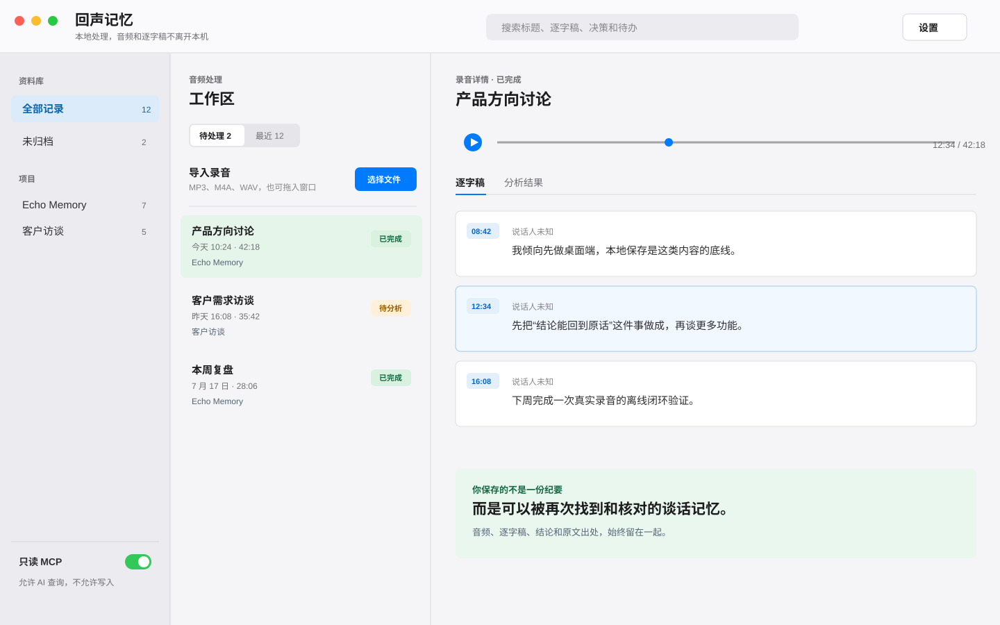

# Echo Memory / 回声记忆

[中文文档](README.zh-CN.md) · [Agent context](docs/agent-context.md) · [MCP reference](docs/mcp.md) · [Security](SECURITY.md)

**A local-first conversation memory library for macOS.** Echo Memory turns important audio into searchable transcripts, traceable decisions, action items, and reusable context for AI tools.

It is not a one-off meeting-summary app. Its purpose is to help you return to **what was said, why a decision was made, and where the supporting evidence lives**.

> Current status: Alpha. Source builds are supported; no signed macOS installer is published yet.

## Why Echo Memory

Important project context often lives in calls, interviews, customer conversations, and personal voice notes. Recordings are hard to revisit, summaries can lose their evidence, and AI tools repeatedly lack the background behind past decisions.

Echo Memory keeps the audio, timestamped transcript, structured analysis, and source references together on your Mac so that a conclusion can lead back to the original words and audio position.

## What it does

- Import `MP3`, `M4A`, and `WAV` files into a managed local library with duplicate detection.
- Transcribe locally with embedded Whisper or a local `whisper.cpp` command; click transcript segments to seek audio and edit corrections without overwriting the original text.
- Extract summaries, key points, decisions, action items, and open questions through a local Ollama model.
- Require decisions and action items to reference source transcript segments; unverified references are marked instead of invented.
- Build project-based personal knowledge libraries and search titles, transcripts, summaries, decisions, and action items with time ranges.
- Expose a user-enabled, local-only, read-only MCP server so AI tools can retrieve relevant historical context with source evidence.

## Local-first by design

Audio, transcripts, SQLite data, and MCP run on your machine. In the current Alpha, Echo Memory does not upload audio or transcripts, silently fall back to cloud processing, expose a public network listener, or let MCP write to your library.

The trade-off is deliberate: local transcription and analysis require local dependencies. Missing models or failed analysis are shown clearly and never destroy already saved audio or transcripts.

## Product flow

```text
Import audio
  -> local timestamped transcript
  -> source-backed decisions and action items
  -> project knowledge library + full-text search
  -> read-only MCP queries for your AI tools
```

## Product overview

The following conceptual interface uses fictional demonstration data only. It illustrates the core workflow: import audio, navigate timestamped evidence, and keep the result in a local project library.



## MCP: a bridge to AI, not a data export

MCP is disabled by default. When you enable it in the app, Echo Memory provides a local stdio server with read-only tools for searching records, reading bounded transcript ranges, listing projects, retrieving project context, and listing action items.

The server records query metadata, not audio, transcript bodies, or keys. It never opens a public port and cannot write, edit, or delete your records. See the [MCP reference](docs/mcp.md) for the tool list and development configuration.

## Personal knowledge library and second brain

Each conversation can be assigned to a project. Over time, the library makes recurring decisions, commitments, questions, and original wording discoverable across conversations. The goal is not to replace your notes; it is to preserve a verifiable layer of work memory that you and your AI tools can revisit.

## Audio hardware and recording cards

Echo Memory currently accepts exported audio files. If an AI recorder, recording card, phone, or field recorder can export MP3, M4A, or WAV, that file can enter the same local workflow. Direct device integrations are not part of the current Alpha and are not implied by this repository.

## Requirements

- macOS
- Node.js 18+, Rust stable, Cargo, Xcode Command Line Tools, and CMake for the first embedded Whisper build
- A local Whisper `ggml-*.bin` model for transcription
- Optional local `whisper-cli` / `WHISPER_CPP_BIN`
- Optional local Ollama service and model for analysis

## Run locally

```bash
cd app
npm install
bash scripts/check-env.sh
npm run tauri dev
```

The default local library is `~/Library/Application Support/回声记忆`. For development and tests, set `ECHO_LIBRARY_ROOT` to an isolated directory.

## Verify

```bash
cd app
npm run typecheck
npm run build
cd src-tauri
cargo fmt --check
cargo test --features mcp-bin
```

## Scope and roadmap

Alpha focuses on a single-user, single-device local workflow. It does **not** currently provide real-time recording, automatic meeting joining, mobile or Windows apps, cloud sync, team collaboration, payment/credits, public APIs, external-system writes, or MCP writes.

Future exploration may include higher-quality processing and audio-hardware workflows, but these are not current product claims.

## Contributing and security

Contributions are welcome. Please read [CONTRIBUTING.md](CONTRIBUTING.md) before opening an issue or pull request. Never attach real audio, transcripts, logs with sensitive content, credentials, or payment data to public issues. See [SECURITY.md](SECURITY.md) for private vulnerability reporting.

## Support

Echo Memory is free and open source. If it helps your work, you can buy the project a coffee. Support helps cover ongoing maintenance, compatibility testing, and documentation; it does not grant paid features or priority support.

<p align="center">
  
</p>

## License

Apache-2.0. See [LICENSE](LICENSE).
