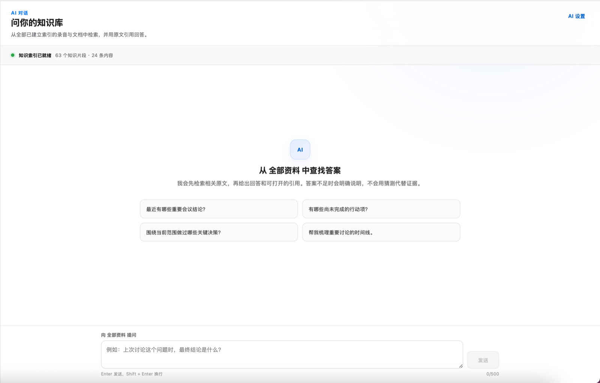
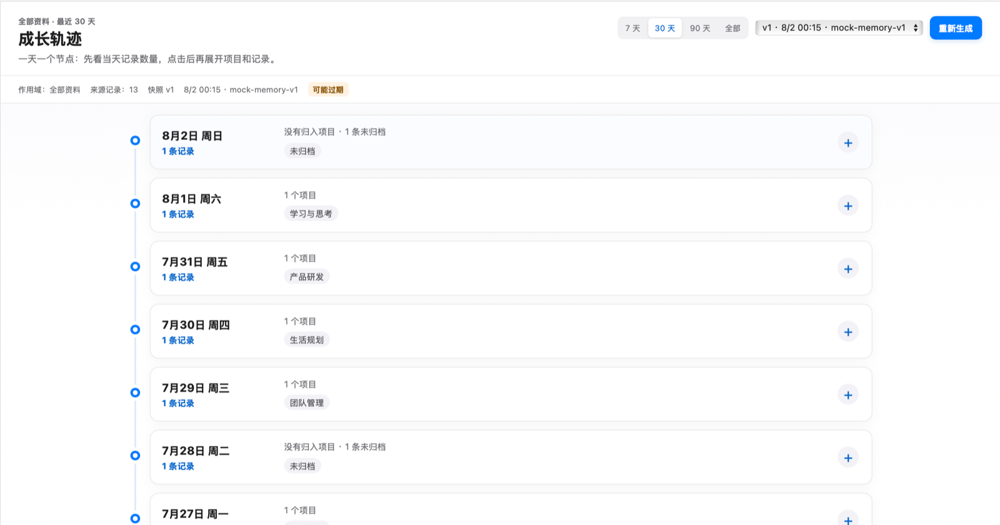
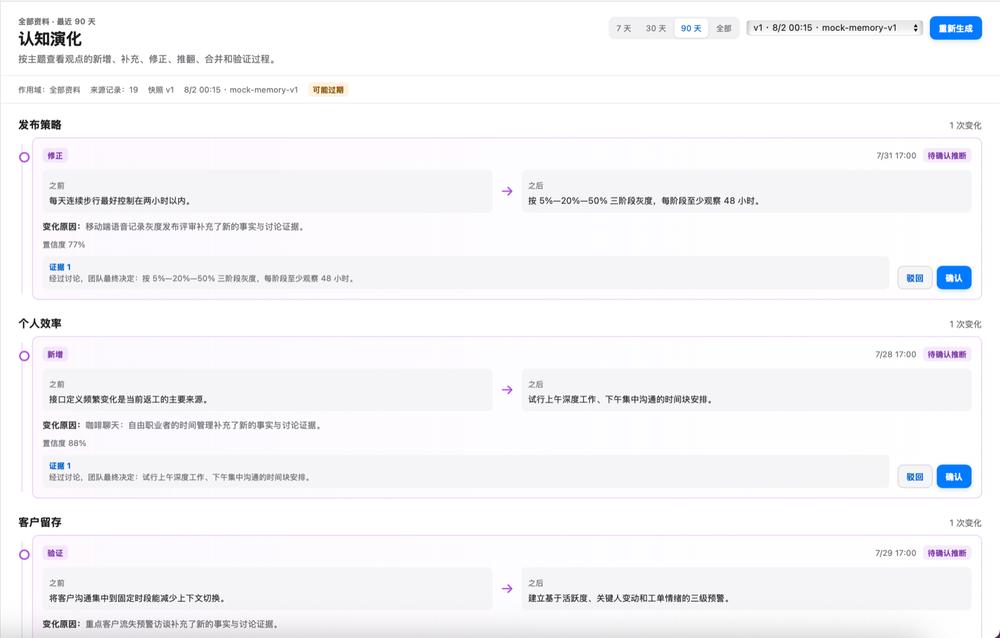

# Echo Memory / 回声记忆

[中文文档](README.zh-CN.md) · [MCP reference](docs/mcp.md) · [Security](SECURITY.md) · [Contributing](CONTRIBUTING.md)

**A Personal Memory OS for AI-native work.** Echo Memory turns conversations, documents, decisions, and changing ideas into a traceable personal memory layer that can be reused by different AI agents.

> AI knows more about the world every day, but it still does not truly know you. Echo Memory gives your AI a memory of what you experienced, why you decided, and how your thinking changed.

The current macOS Alpha is the first working slice of this direction. It is not yet a complete personal digital twin, but it already closes the loop from source material to evidence-backed retrieval and agent access.

## Why it exists

People generate valuable context continuously: meetings, calls, customer feedback, voice notes, documents, AI conversations, decisions, and follow-up results. That context is usually scattered across tools and quickly loses its connection to time, evidence, and later outcomes.

Traditional tools mainly preserve files or produce one-off summaries. Echo Memory is designed around a longer loop:

```text
Capture -> Understand -> Connect -> Evolve -> Retrieve -> Feedback
```

The goal is not to save more notes. It is to preserve a person's experiences and reasoning as a durable, user-controlled context layer for future AI.

## Product position

Echo Memory is not defined by transcription or meeting summaries. Those are input and processing capabilities.

The long-term product has four connected layers:

1. **Personal Memory Layer**: shared, permissioned context so every AI does not need to learn the user from zero.
2. **Cognitive Database**: evidence-backed records of knowledge, decisions, open questions, and how beliefs change.
3. **Personal Memory OS**: one system for capture, understanding, organization, retrieval, and feedback.
4. **Digital Twin Database**: a long-term, correctable model of what a person experienced, knows, values, and how they make decisions.

The digital-twin direction is a product vision, not a claim that the current Alpha can fully model a person.

## What the current Alpha does

- First-run onboarding: environment check, resumable local model downloads, and inbox setup.
- Audio inbox: watch folders and USB recorders; new audio imports, transcribes, and analyzes automatically.
- Personal hotword vocabulary injected into transcription, with optional local LLM correction that never overwrites the original transcript.
- Cross-record action items and open questions dashboard with completion tracking and evidence jumps.
- Assistant dock: chat with local (or optional external) models from any view — summarize the current record, create writing, or brainstorm.
- AI template wizard: describe your needs in conversation; a local model generates the analysis template.
- Output folder: analyses, transcripts, and AI drafts are written as standard Markdown into a folder of your choice (e.g. an Obsidian vault).
- Speaker diarization: optionally run the whisperX engine to separate "Speaker 1, Speaker 2…"; the embedded engine stays the zero-dependency default.
- Speaker renaming: turn "Speaker 1" into a real name in the record detail, optionally adding it to the hotword vocabulary; action items and decisions carry the attributed owner.
- Imports `MP3`, `M4A`, and `WAV` audio with duplicate detection.
- Imports `Markdown`, `TXT`, and `DOCX` documents into the same searchable library.
- Transcribes audio locally with embedded Whisper or a local `whisper.cpp` command.
- Uses local Ollama models for summaries, key points, decisions, action items, and open questions.
- Preserves timestamped transcript evidence and lets users return from a conclusion to its source.
- Organizes records into project knowledge libraries with local full-text and vector retrieval.
- Answers questions across indexed audio and documents with openable citations.
- Shows a day-based growth timeline across projects and records.
- Generates versioned cognitive-evolution snapshots with reviewable evidence and feedback.
- Exposes an opt-in, local, read-only MCP server for authorized AI tools.

## What makes it different

### Time is the backbone

Memory is not a folder tree. Events, projects, people, questions, and decisions develop in parallel. Echo Memory keeps when something happened and how later information relates to it.

### Evidence is more important than a summary

Important conclusions should return to original transcript segments, timestamps, or document sources. AI inference is marked and reviewable instead of being presented as user-authored fact.

### Memory keeps its history

A changed opinion is not a database error. Versioned memory preserves what was believed before, what changed, and which evidence caused the change.

### Memory is callable

With user authorization, different AI tools can retrieve the context needed for a task through MCP without forcing the user to repeat the same background in every chat.

## Current interface

The screenshots use synthetic demonstration data.

### Evidence-backed knowledge chat



### Growth timeline



### Cognitive evolution



## Local-first and user-controlled

Audio, the SQLite library, local transcription, local analysis, retrieval, and MCP remain on the Mac by default.

External AI is disabled by default. If a user enables it and explicitly confirms a generation, Echo Memory sends only the selected scope's text and existing structured analysis to the configured OpenAI-compatible service. Original audio is never uploaded by this feature. API keys are stored in macOS Keychain.

Generated cross-record memory is versioned, linked to sources, and can be confirmed or rejected. It does not overwrite original recordings, transcripts, or single-record analysis.

## MCP: one memory layer for many agents

The current MCP server is local stdio, disabled by default, and read-only. It can search records, retrieve bounded transcript ranges, list projects, return project context, and list action items. It does not open a public port or modify the library.

See the [MCP reference](docs/mcp.md) for tools and development configuration.

## Product principles

- **The user owns the memory:** data should remain exportable, correctable, deletable, and revocable.
- **Original evidence outranks AI summaries:** important claims must remain traceable.
- **Time and versions are preserved:** new conclusions do not erase old reasoning.
- **High-impact automation is confirmable:** inferred relationships and changes must be reviewable.
- **Agent access follows least privilege:** tools receive only the context required for the task.
- **The system assists decisions, not replaces the user:** uncertainty and conflicting evidence should remain visible.

## Current boundary and direction

The Alpha focuses on a single-user, single-device workflow. It does not currently provide real-time recording, automatic meeting joining, mobile or Windows apps, cloud sync, team collaboration, public APIs, or MCP writes.

The longer-term direction is to expand from traceable conversation memory into a personal memory infrastructure that can connect events, people, projects, questions, knowledge, decisions, and outcomes across time. That direction still requires product, privacy, and user-trust validation.

## Requirements

- macOS on Apple Silicon
- Node.js 22+, Rust stable, Cargo, and Xcode Command Line Tools
- CMake for the first embedded Whisper build
- A local Whisper `ggml-*.bin` model for transcription
- Optional local `whisper-cli` / `WHISPER_CPP_BIN`
- Optional local Ollama service and model for analysis
- Optional `pip install whisperx` and a HuggingFace token (after accepting the pyannote model terms) for speaker diarization

## Run locally

```bash
cd app
npm install
bash scripts/check-env.sh
npm run tauri dev
```

The default library is stored at `~/Library/Application Support/回声记忆`. Use `ECHO_LIBRARY_ROOT` for an isolated development or test library.

## Verify

```bash
cd app
npm run typecheck
npm run build
npm run test:growth
npm run test:ui
cd src-tauri
cargo fmt --check
cargo test --features mcp-bin
```

## Project status

Echo Memory is Alpha software. Source builds are supported. A notarized macOS installer is not currently published in GitHub Releases.

Contributions are welcome. Read [CONTRIBUTING.md](CONTRIBUTING.md) before opening an issue or pull request, and never attach real audio, transcripts, databases, credentials, or private customer material to a public issue. Security reports should follow [SECURITY.md](SECURITY.md).

## Support

Echo Memory is free and open source. Support helps fund maintenance, compatibility testing, and documentation.

<p align="center">
  
</p>

## License

Apache-2.0. See [LICENSE](LICENSE).
